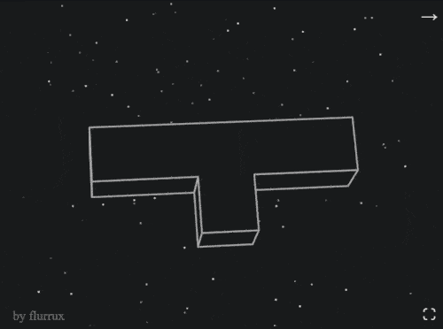

# rigidbody-rotation-sim

small simulation of a rotating rigid body.  
made with typescript and [Canvas2D](https://developer.mozilla.org/de/docs/Web/API/CanvasRenderingContext2D) only.  

interactive: https://rigidbodyrotation.netlify.app

