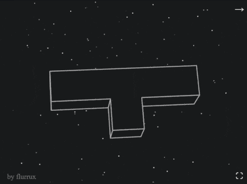

# rigidbody-rotation-sim

Small simulation of a rotating rigid body.  
Made with typescript and [Canvas2D](https://developer.mozilla.org/de/docs/Web/API/CanvasRenderingContext2D) only.  

Try here: https://flurrux.github.io/rigidbody-rotation-sim/

